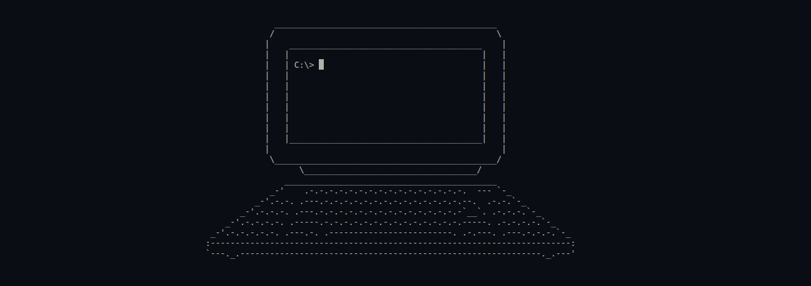
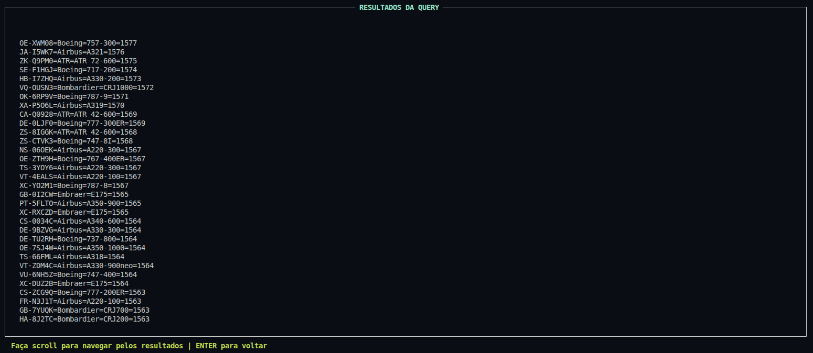

# -͟͟͞✈︎ LI3

This project is a C-based database system for managing airline-related information, including airports, flights, passengers, and reservations. 

First phase: ? / 20 :star: 

Second phase: ? / 20 :star:

##  Interactive Mode
The following images showcase the intuitive ncurses-based interface, structured around a hierarchy of **Frames** and **Pads**.

Additional images can be found in [`docs/images`](docs/images).

##   Authors

**Débora Caetano** - [@deboravcaetano](https://github.com/deboravcaetano)  
**Matheus Azevedo** - [@matheusm18](https://github.com/matheusm18)  
**Francisco Martins** - [@XicoMartins707](https://github.com/XicoMartins707)
